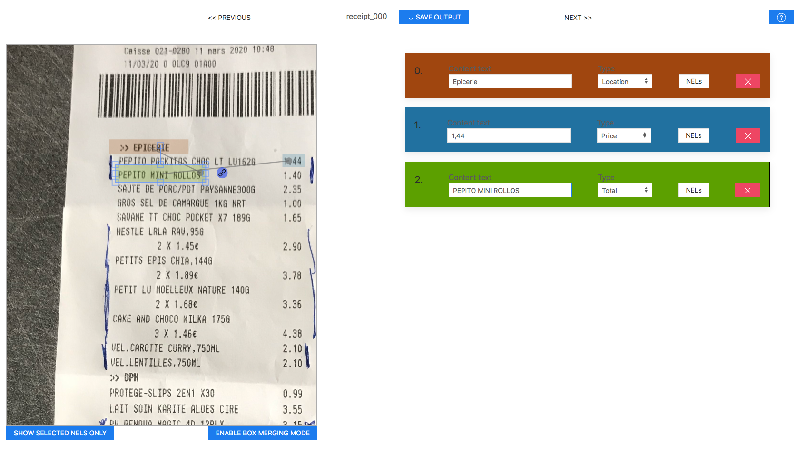

# Banksy annotation tool 


## 📃 Description

Banksy is an image annotation tool, outputting a dataset with NER (Named Entity Recognition), NEL (Named Entity Linking) and box region on image. 

The dataset format is very similar to the [FUNSD dataset](https://guillaumejaume.github.io/FUNSD/).
This tool is useful if you need to annotate documents where the spatial component of the text data is important (i.e **where** the text is in the document). Practical examples might be forms, receipts, etc.

You can also find a Python client for the OCR Google Vision. You can call the OCR with the image you want to annotate, and it will return you a JSON file with the text found in the image, and the position of that text in the image.
You can then add the JSON file to your `source` folder (see the Usage section below) and will create automatically boxes for you. 

You can learn more about the Python client [here](/vision/README.md).

## Screenshot


## 🔧 Getting Started 

### Requirements
- NPM (to serve the files, but you can use any other tool to do it)
- Chrome (The tool only works on chrome, as it uses modules and Webpack isn't in the project)

### Installation

Clone this project

```
git clone git@github.com:AboutGoods/Banksy-annotation-tool.git
```

In order to serve the files, you can use the `serve` package from NPM :

```
npm install -g serve
```

### Launch 🚀

To launch the tool, you simply need to serve the files, so you can use `serve` 

*In the project repository :*

```
serve
```

Or if you want to specify the port :

```
serve -l 8080
```

## Usage 

First you need to add images in the `source` folder. The images needs to be named like `image_000.jpg`, `image_001.jpg`, ... You can also add Google Vision results for each image like so : `image_000.json`, `image_001.json`, ...

You can now go access to the app (http://localhost:5000 if you used `serve`)

### Creating/Managing boxes 📦

When you go to the app, the first image is shown, and you can start drawing boxes by holding the left mouse click. You can undo / redo any action you do by pressing `Ctrl + Z` (or `Cmd + Z`) and `Ctrl + Maj + Z` (or `Cmd + Maj + Z`)

You can also merge boxes, by clicking the `Merging mode` button on the bottom. You will now be able to select multiple boxes by drag-clicking on the image. Once you have selected the right boxes, you can merge them by pressing `m`.

On the right side, you can see a list of the boxes you created, and can change the content, the label, modify or delete links and delete the box. 

When you select a box, its corresponding element in the list is highlighted.
You can also delete a box with the `del` key.

### Links 🔗

In order to create links between boxes, select the box that will be the starting point of the link, then click and hold the blue square on the right, and drop the link on the desired destination box.

### Utils 🛠

You can zoom in and out with the mouse wheel, and move in the receipt by maintaining the `Ctrl` or `Cmd` key.

When selecting a box, you can change its label with the numeric keys on top of you keyboard:

- `1` : Label
- `2` : Price
- `3` : Bundle
- `4` : Misc
- `5` : Payment
- `6` : Barcode
- `7` : Brand
- `8` : Location
- `9` : Date
- `0` : Phone
- `)` (key at the right of the 0) : Person


When you finish the annotation of an image, simply hit "Save output" on the top of the screen. A JSON file with all the data will be downloaded.

You can then go to the next receipt by clicking on the next button, on the top right, or go back with the previous button. Your work will be saved in local storage.

## Contributing 🤝

See [CONTRIBUTING.md](/CONTRIBUTING.md).

## License 📃

See [LICENSE](/LICENSE).


